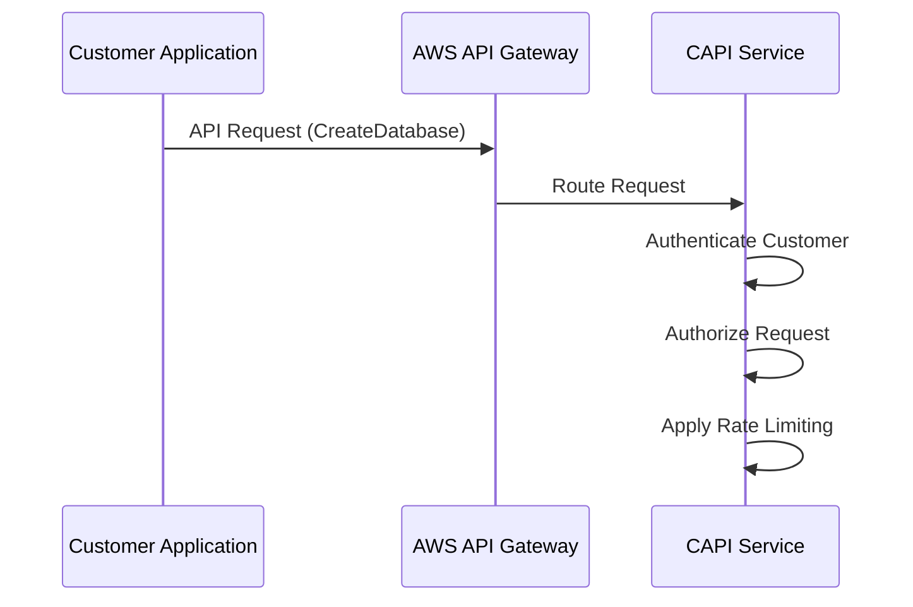
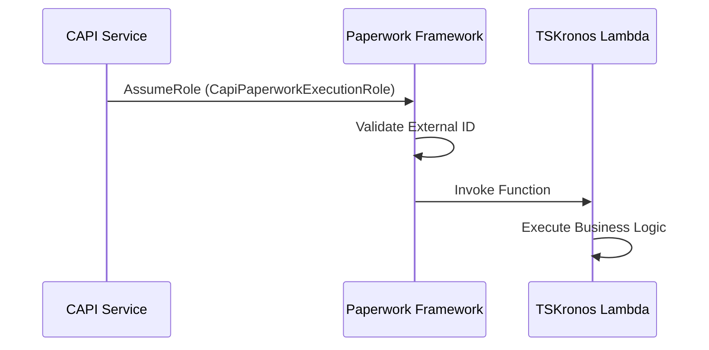
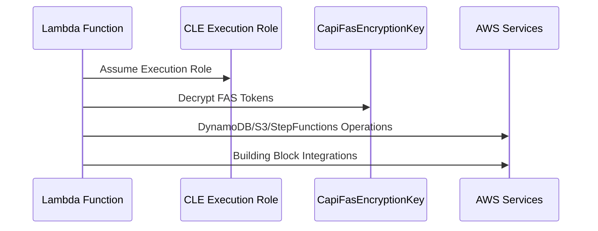
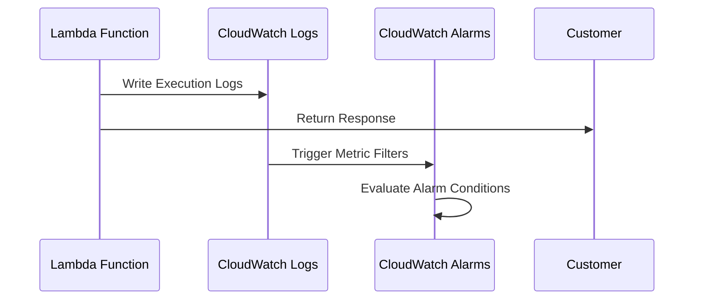

# TSKronos WebService: Architecture Deep Dive and CBB Migration Guide

## Table of Contents
1. [Architecture Overview](#architecture-overview)
2. [Complete Request Flow Analysis](#complete-request-flow-analysis)
3. [Traffic Switching Mechanism](#traffic-switching-mechanism)
4. [Resource Management and Conflict Resolution](#resource-management-and-conflict-resolution)
5. [Automatic vs Manual Resource Updates](#automatic-vs-manual-resource-updates)
6. [Detailed Q&A from Technical Discussion](#detailed-qa-from-technical-discussion)

---

## Architecture Overview

### What is TSKronos WebService?

TSKronos WebService serves as the **control plane API** for Amazon Timestream for InfluxDB, functioning as the central management system for database lifecycle operations. It provides a comprehensive suite of capabilities:

- **Database Lifecycle Management**: Complete CRUD operations for InfluxDB instances
- **Authentication & Authorization**: Fine-grained access control through FAS (Fine-grained Access Service)
- **Resource Metadata Management**: Comprehensive tagging and organization of database resources
- **Cross-Service Integration**: Seamless integration with AWS services and Alameda building blocks
- **Compliance & Auditing**: Full request logging and audit trail maintenance

### High-Level Architecture Components

#### 1. Customer Interface Layer
```
External Customers (Console/CLI/SDK)
        ↓
AWS API Gateway (AWS-managed)
        ↓
CAPI Service (Customer API Building Block)
```

**CAPI Service Responsibilities:**
- **Primary Authentication**: Validates customer credentials using AWS IAM
- **Authorization Enforcement**: Checks customer permissions for requested operations
- **Rate Limiting & Throttling**: Prevents abuse and ensures fair resource usage
- **Request Routing**: Directs requests to appropriate backend services
- **Audit Logging**: Records all API calls for compliance and debugging
- **Error Handling**: Provides consistent error responses to customers

#### 2. Cross-Account Integration Layer
```
CAPI Service (Account A)
        ↓
Paperwork Framework (Cross-Account Bridge)
        ↓ 
TSKronos Lambda Function (Account B)
```

**Paperwork Framework Purpose:**
- **Cross-Account Security**: Enables secure service-to-service communication across AWS accounts
- **Role-Based Access**: Uses IAM roles with external ID conditions for authentication
- **Service Discovery**: Automatically locates the correct Lambda function endpoints
- **Multi-Version Support**: Supports multiple authentication patterns (v1, v2, v3) for backward compatibility

**Why Cross-Account Architecture?**
- **Security Isolation**: CAPI and backend services operate in separate security domains
- **Blast Radius Limitation**: Issues in one account don't affect the other
- **Independent Scaling**: Services can scale independently based on their specific needs
- **Compliance Requirements**: Meets security requirements for service isolation

#### 3. Core Processing Layer
```
Lambda Function: TSKronosWebService-CoralLambdaFunction
        ↓
Execution Role: TSKronosWebServiceCLERole
        ↓
Business Logic Execution
        ↓
AWS Services Integration
```

**Lambda Function Capabilities:**
- **Business Logic Implementation**: All Timestream InfluxDB API operations
- **Resource Orchestration**: Coordinates operations across multiple AWS services
- **Security Token Management**: Handles FAS token encryption/decryption using KMS
- **Error Handling & Retry Logic**: Implements robust error handling patterns
- **Performance Optimization**: Memory and execution time optimization

**CLE Role Permissions:**
- **Core AWS Services**: DynamoDB (metadata), S3 (configurations), StepFunctions (workflows)
- **Security Services**: SecretsManager (credentials), KMS (encryption keys)
- **Compute Services**: EC2 (instance management), Lambda (function invocation)
- **Building Block Access**: Alameda Orchestra, Metadata service, Deploy service
- **Configuration Services**: SDC (dynamic config), ARS (subscription validation)

#### 4. Monitoring and Observability Layer
```
Lambda Execution
        ↓
CloudWatch Logs (/aws/lambda/functionName)
        ↓
CloudWatch Alarms (Memory, Errors, Logscan)
        ↓
Operational Alerting & Response
```

**Monitoring Components:**
- **Performance Metrics**: Memory utilization, execution duration, invocation rates
- **Error Detection**: Automatic log scanning for ERROR/FATAL patterns
- **Deployment Safety**: Blue-green deployment monitoring with automatic rollback
- **Operational Alerting**: Automatic ticket creation for critical issues
- **Long-term Retention**: Configurable log retention (1 month dev, 10 years prod)

#### 5. Integration Testing Layer
```
CI/CD Pipeline
        ↓
HydraStack (Integration Test Framework)
        ↓
Multiple Test Suites (CRUD, AuthZ, Security, CloudTrail)
        ↓
Production Readiness Validation
```

**Hydra Testing Framework:**
- **End-to-End Testing**: Complete API workflow validation
- **Security Compliance**: Taj security tests for regulatory compliance
- **Cross-Service Validation**: Integration testing with dependent services
- **Canary Monitoring**: Production health checks and validation
- **Multi-Environment Support**: Testing across different deployment stages

---

## Complete Request Flow Analysis

### Current Java CDK Request Flow

#### Step 1: Customer Request Initiation


**What Happens:**
1. **Customer Authentication**: AWS IAM validates customer credentials
2. **Request Validation**: API Gateway validates request format and parameters
3. **Rate Limiting**: CAPI enforces per-customer rate limits
4. **Authorization Check**: CAPI verifies customer has permission for the operation

#### Step 2: Cross-Account Service Invocation


**What Happens:**
1. **Role Assumption**: CAPI assumes CapiPaperworkExecutionRole with external ID validation
2. **Security Verification**: Paperwork validates the external ID condition ('kronos:*')
3. **Function Invocation**: Lambda function receives the request payload
4. **Context Setup**: Lambda establishes execution context with CLE role

#### Step 3: Core Business Logic Execution


**What Happens:**
1. **Role Assumption**: Lambda assumes TSKronosWebServiceCLERole for AWS service access
2. **Token Decryption**: FAS tokens are decrypted using CapiFasEncryptionKey
3. **Service Operations**: Database metadata operations via DynamoDB, configuration via S3
4. **Workflow Orchestration**: Complex operations via StepFunctions
5. **Building Block Integration**: Calls to Alameda Orchestra, Metadata services

#### Step 4: Response and Monitoring


**What Happens:**
1. **Response Generation**: Lambda formats and returns the API response
2. **Logging**: All execution details logged to CloudWatch
3. **Metric Generation**: Performance and error metrics collected
4. **Alarm Evaluation**: CloudWatch alarms evaluate against thresholds

### New CBB Request Flow

The CBB (Custom Building Block) version maintains identical business logic while using parallel infrastructure:

#### Key Differences in CBB Flow:
1. **Parallel Resource Names**: All AWS resources have `-cbb` suffix
2. **Identical Business Logic**: Same Lambda code, same AWS service interactions
3. **Isolated Infrastructure**: Complete resource isolation during migration
4. **Same External Interface**: No changes visible to customers

#### CBB Resource Mapping:
```
Java CDK Resources                    →    CBB Resources
├── CapiPaperworkExecutionRole       →    CapiPaperworkExecutionRole-cbb
├── TSKronosWebService-Lambda        →    TSKronosWebService-Lambda-cbb
├── TSKronosWebServiceCLERole        →    TSKronosWebServiceCLERole-cbb
├── CapiFasEncryptionKey             →    CapiFasEncryptionKey-cbb
└── CloudWatch Resources             →    CloudWatch Resources-cbb
```

---

## Traffic Switching Mechanism

### Overview of Switch Strategy

The traffic switch operates on a **single configuration change** principle - updating the CAPI service configuration to point to new Paperwork execution roles triggers the entire resource chain automatically.

### Switch Implementation Options

#### Option 1: CAPI Configuration Switch (Recommended)

**Location**: CAPI Service Configuration (External System)

**Configuration Change:**
```yaml
# BEFORE (Java CDK)
paperwork_execution_roles:
  - arn:aws:iam::ACCOUNT:role/CapiPaperworkExecutionRole
  - arn:aws:iam::ACCOUNT:role/CapiPaperworkExecutionRole_v2
  - arn:aws:iam::ACCOUNT:role/CapiPaperworkExecutionRole_v3

# AFTER (CBB)
paperwork_execution_roles:
  - arn:aws:iam::ACCOUNT:role/CapiPaperworkExecutionRole-cbb
  - arn:aws:iam::ACCOUNT:role/CapiPaperworkExecutionRole-cbb_v2
  - arn:aws:iam::ACCOUNT:role/CapiPaperworkExecutionRole-cbb_v3
```

**Automatic Chain Reaction:**
1. **CAPI Discovery**: CAPI service discovers and uses new `-cbb` suffixed roles
2. **New Role Usage**: CAPI assumes CapiPaperworkExecutionRole-cbb instead of original
3. **Lambda Invocation**: New role invokes TSKronosWebService-CoralLambdaFunction-cbb
4. **Execution Context**: New Lambda uses TSKronosWebServiceCLERole-cbb execution role
5. **Resource Access**: New execution role accesses CapiFasEncryptionKey-cbb for encryption
6. **Monitoring**: All CloudWatch logs and alarms automatically use CBB resources

#### Option 2: Lambda Alias Weighted Routing

**Implementation**: Gradual traffic shift using Lambda weighted aliases

**Traffic Distribution:**
```
Phase 1: 100% → Java CDK Lambda, 0% → CBB Lambda
Phase 2: 90% → Java CDK Lambda, 10% → CBB Lambda
Phase 3: 50% → Java CDK Lambda, 50% → CBB Lambda
Phase 4: 0% → Java CDK Lambda, 100% → CBB Lambda
```

**Benefits:**
- **Gradual Migration**: Reduces risk through incremental traffic shift
- **Real-time Monitoring**: Ability to monitor CBB performance under increasing load
- **Quick Rollback**: Immediate rollback capability if issues detected

#### Option 3: Blue-Green Complete Switch

**Implementation**: Complete traffic switch with immediate rollback capability

**Process:**
1. **Deploy CBB (Green)**: Complete CBB infrastructure deployment
2. **Validation Testing**: Comprehensive testing of CBB resources
3. **Traffic Switch**: Instant 100% traffic switch to CBB
4. **Monitoring Period**: Extended monitoring of CBB performance
5. **Cleanup**: Removal of Java CDK (Blue) resources after validation

### Critical Dependencies During Switch

#### Paperwork Role Dependencies
- **Policy Accuracy**: CapiPaperworkExecutionRole-cbb must have identical lambda:InvokeFunction permissions
- **External ID Validation**: Correct external ID conditions for CAPI service authentication
- **Resource ARN Accuracy**: Policies must reference correct CBB Lambda function ARNs

#### Lambda Execution Role Dependencies
- **Permission Parity**: TSKronosWebServiceCLERole-cbb must have all existing AWS service permissions
- **KMS Access**: Decrypt permissions on CapiFasEncryptionKey-cbb
- **Building Block Access**: Maintained access to Alameda BB, Metadata BB, SDC, ARS services

#### KMS Key Dependencies
- **Key Policy Alignment**: CapiFasEncryptionKey-cbb must have identical key policies
- **Service Principal Access**: CAPI service principals must have encrypt permissions
- **Lambda Role Access**: Lambda execution role must have decrypt permissions

#### Environment Variable Dependencies
- **Automatic ARN Resolution**: Environment variables automatically resolve to new CBB resource ARNs
- **Configuration Consistency**: All environment variables maintain same values except resource references
- **No Lambda Code Changes**: Business logic remains completely unchanged

---

## Resource Management and Conflict Resolution

### Resources Requiring Manual Suffix Addition

#### CloudFormation Stacks (4 Resources)
| **Current Name** | **New Name with Suffix** |
|------------------|--------------------------|
| TSKronosWebServiceInfra-{stage}-{region} | TSKronosWebServiceInfra-{stage}-{region}-cbb |
| TSKronosWebServiceAPI-{stage}-{region} | TSKronosWebServiceAPI-{stage}-{region}-cbb |
| TSKronosSdbbConfiguration-{stage}-{region} | TSKronosSdbbConfiguration-{stage}-{region}-cbb |
| TSKronosWebServiceHydraStack-{stage} | TSKronosWebServiceHydraStack-{stage}-cbb |

#### IAM Roles (11 Resources)
| **Current Name** | **New Name with Suffix** |
|------------------|--------------------------|
| TSKronosWebServiceCLERole | TSKronosWebServiceCLERole-cbb |
| sdbbPatchWorkflowRole | sdbbPatchWorkflowRole-cbb |
| CapiAuthRole | CapiAuthRole-cbb |
| CapiTagrisRole | CapiTagrisRole-cbb |
| CapiTagrisRole_v2 | CapiTagrisRole-cbb_v2 |
| CapiTagrisRole_v3 | CapiTagrisRole-cbb_v3 |
| CapiPaperworkExecutionRole | CapiPaperworkExecutionRole-cbb |
| CapiPaperworkExecutionRole_v2 | CapiPaperworkExecutionRole-cbb_v2 |
| CapiPaperworkExecutionRole_v3 | CapiPaperworkExecutionRole-cbb_v3 |
| HydraInvocationRole-{buildingBlockName}-{stage} | HydraInvocationRole-{buildingBlockName}-{stage}-cbb |
| TajHydraInvocationRole | TajHydraInvocationRole-cbb |

#### Lambda Function Resources (4 Resources)
| **Current Name** | **New Name with Suffix** |
|------------------|--------------------------|
| TSKronosWebService-CoralLambdaFunction | TSKronosWebService-CoralLambdaFunction-cbb |
| /aws/lambda/{functionName}Log | /aws/lambda/{functionName}Log (LogGroup name) |
| live (Lambda alias) | live (on new CBB function) |
| CoralLambdaDeploymentGroup | CoralLambdaDeploymentGroup-cbb |

#### KMS Keys (1 Resource)
| **Current Name** | **New Name with Suffix** |
|------------------|--------------------------|
| CapiFasEncryptionKey | CapiFasEncryptionKey-cbb |

#### CloudWatch Resources (5 Resources)
| **Current Name** | **New Name with Suffix** |
|------------------|--------------------------|
| NewFunctionSuccessRateAlarm-{serviceName} | NewFunctionSuccessRateAlarm-{serviceName}-cbb |
| OverallFunctionSuccessRateAlarm-{serviceName} | OverallFunctionSuccessRateAlarm-{serviceName}-cbb |
| [{stage}][{cellIdentifier}] {functionName} memory utilization alarm | [{stage}][{cellIdentifier}] {functionName}-cbb memory utilization alarm |
| [{stage}][{cellIdentifier}] Logscan Alarm for {functionName} | [{stage}][{cellIdentifier}] Logscan Alarm for {functionName}-cbb |
| ControlPlaneLogScan/{functionName} Logscan Errors | ControlPlaneLogScan/{functionName}-cbb Logscan Errors |

#### CDK Construct IDs (2 Resources)
| **Current Name** | **New Name with Suffix** |
|------------------|--------------------------|
| HydraTestRunResources | HydraTestRunResources-cbb |
| TajHydraTestRunResources | TajHydraTestRunResources-cbb |

**Total: 27 resources requiring manual suffix addition**

---

## Automatic vs Manual Resource Updates

### Resources That Update Automatically (No Code Changes Required)

#### 1. Lambda Function Metrics and Dimensions
**Why Automatic**: Metrics use dynamic Lambda function properties, not hardcoded strings

**Current Metrics:**
```yaml
FunctionName: "TSKronosWebService-CoralLambdaFunction"
Resource: "TSKronosWebService-CoralLambdaFunction:live"
```

**CBB Metrics (Automatic):**
```yaml
FunctionName: "TSKronosWebService-CoralLambdaFunction-cbb"
Resource: "TSKronosWebService-CoralLambdaFunction-cbb:live"
```

**Technical Explanation**: CDK uses `lambdaFunction.functionName` property in metric creation, which automatically reflects the new CBB function name.

#### 2. Environment Variable ARN References
**Why Automatic**: Environment variables use parameter injection, not static constants

**Current Environment Variables:**
```typescript
CAPI_FAS_ENCRYPTION_KEY_ARN: {existing-kms-key-arn}
```

**CBB Environment Variables (Automatic):**
```typescript
CAPI_FAS_ENCRYPTION_KEY_ARN: {new-cbb-kms-key-arn}
```

**Technical Explanation**: The `capiFasEncryptionKeyArn` parameter comes from the CBB InfraStack, automatically providing the CBB KMS key ARN.

#### 3. Paperwork Role Lambda ARN References
**Why Automatic**: Lambda ARNs are dynamically generated and stored in arrays

**Process Flow:**
1. CBB Lambda function created with `-cbb` suffix name
2. CDK automatically generates CBB Lambda ARN
3. CBB Lambda ARN added to `cellularLambdaArns` array
4. Paperwork roles automatically reference CBB Lambda ARN in policies

#### 4. CloudFormation System Tags
**Why Automatic**: AWS CloudFormation automatically manages system tags

**Current Tags:**
```yaml
aws:cloudformation:stack-name: "TSKronosWebServiceAPI-alpha-us-west-2"
aws:cloudformation:stack-id: "{original-stack-id}"
aws:cloudformation:logical-id: "LambdaFunctionLogGroup"
```

**CBB Tags (Automatic):**
```yaml
aws:cloudformation:stack-name: "TSKronosWebServiceAPI-alpha-us-west-2-cbb"
aws:cloudformation:stack-id: "{new-cbb-stack-id}"
aws:cloudformation:logical-id: "LambdaFunctionLogGroup-cbb"
```

### Resources Requiring Manual Updates

#### 1. Environment Variable Alias References
**Why Manual**: Static constants need explicit CBB versions

**Required Change:**
```typescript
// CURRENT
'FasEncryptionKey': ResourceConstants.FAS_ENCRYPTION_KMS_KEY_ALIAS

// NEEDS CHANGE TO
'FasEncryptionKey': ResourceConstants.FAS_ENCRYPTION_KMS_KEY_ALIAS_CBB
```

**Technical Explanation**: This environment variable uses a hardcoded constant reference that must be updated to point to the CBB KMS key alias.

#### 2. Resource Constants
**Why Manual**: New constants needed for CBB resources

**Required Additions:**
```typescript
export const CORAL_LAMBDA_FUNCTION_NAME_CBB = '%s-CoralLambdaFunction-cbb';
export const FAS_ENCRYPTION_KMS_KEY_ALIAS_CBB = 'alias/FasEncryptionKey-cbb';
export const CapiFasEncryptionKeyCbb = 'CapiFasEncryptionKey-cbb';
```

### Shared Resources (No Changes Needed)

#### Certificate Secret Encryption Key
**Resource**: `SECRET_ENCRYPTION_KMS_KEY_ALIAS_ARN`
**Why No Change**: Points to shared `CertificateSecretEncryptionKey` used by both systems
**Technical Explanation**: Certificate encryption should remain shared to maintain certificate interoperability between Java CDK and CBB systems.

---

## Technical Implementation Details and Resource Analysis

This section provides detailed analysis of resource management strategies during the CBB migration, explaining which resources require manual changes versus automatic updates through CDK's Infrastructure as Code capabilities.

### Policy Management for IAM Roles

#### HydraInvocationRole Policy Handling
**Implementation Status: No Changes Required**

The HydraStack implementation uses inline policy statements rather than managed policies, which eliminates naming conflicts:

```typescript
const ec2AccessPolicy = new PolicyStatement({
    sid: 'EC2AccessPolicy',  // Statement ID within policy document
    effect: Effect.ALLOW,
    actions: [/* EC2 permissions */],
    resources: ['*']
});

hydraInvocationRole.addToPolicy(ec2AccessPolicy);  // Attached as inline policy
```

**Key Benefits:**
- Policy statements are inline policies attached directly to each IAM role
- Statement IDs serve as identifiers within each role's policy document
- Each role maintains its own separate policy document, preventing cross-role conflicts
- Inline policies are naturally scoped to their respective roles

### Resource Identification Strategy

#### Physical vs Logical Resource Identifiers
**Critical Distinction for Migration Planning**

**Physical IDs (AWS Resource Names) - Mandatory Changes:**
These create actual AWS resources that would conflict between Java CDK and CBB deployments:
```typescript
invocationRoleName: `HydraInvocationRole-${buildingBlockName}-${stage}`  // MUST change to include -cbb
invocationRoleName: "TajHydraInvocationRole"  // MUST change to include -cbb suffix
```

**Logical IDs (CDK Construct IDs) - Recommended Changes:**
These are CDK construct identifiers within CloudFormation templates:
```typescript
new HydraTestRunResources(this, 'HydraTestRunResources', {...})  // RECOMMENDED to add -cbb suffix
new HydraTestRunResources(hydraStack, "TajHydraTestRunResources", {...})  // RECOMMENDED to add -cbb suffix
```

**Logical ID Safety Analysis:**
- Logical IDs are scoped within their respective CloudFormation stacks
- Different stacks isolate logical IDs naturally (TSKronosWebServiceHydraStack-alpha vs TSKronosWebServiceHydraStack-alpha-cbb)
- No conflicts occur between logical IDs in different stacks

**Recommendation Rationale:**
While logical ID changes are technically optional, they provide significant operational benefits:
- **Consistency**: Makes resource ownership clear across all resource types
- **Debugging**: Easier identification in CloudFormation console during troubleshooting
- **Maintenance**: Clearer code organization and resource tracking for future developers

### Automated Dependency Resolution

#### Paperwork Lambda Resource Integration
**Implementation Status: Fully Automatic**

The CDK's Infrastructure as Code capabilities handle Lambda ARN propagation automatically:

1. **Lambda Creation**: CoralLambda created with CBB suffix name
2. **ARN Generation**: CDK automatically generates CBB Lambda ARN from function name
3. **Array Population**: `cellularLambdaArns.push(lambdaArn)` adds CBB ARN to policy array
4. **Policy Creation**: Paperwork roles automatically receive policies referencing CBB Lambda ARN

**Code Flow Demonstration:**
```typescript
// Lambda function created with CBB name
const coralLambda = new CoralLambda(this, 'LambdaFunction', {
    lambdaFunctionName: 'TSKronosWebService-CoralLambdaFunction-cbb'
});

// ARN automatically generated and propagated
const lambdaArn = coralLambda.lambdaFunction.functionArn;
cellularLambdaArns.push(lambdaArn);

// Paperwork roles automatically receive CBB Lambda ARN policies
CapiPaperworkRoleHelper.createPaperworkExecutionRole(
    this, cellularLambdaArns, airportCode, ['kronos:*']
);
```

**Automation Benefits:**
- Infrastructure as Code ensures automatic ARN dependency resolution
- No manual string manipulation required anywhere in the codebase
- Single point of change principle: modify Lambda function name once, everything else updates automatically

### Environment Variable Management Strategy

#### KMS Key Reference Analysis
**Mixed Implementation Requirements**

**CAPI_FAS_ENCRYPTION_KEY_ARN - Automatic Update:**
```typescript
[ResourceConstants.CAPI_FAS_ENCRYPTION_KEY_ARN]: capiFasEncryptionKeyArn
```
This parameter uses dependency injection from CBB InfraStack, automatically providing the CBB KMS key ARN.

**FasEncryptionKey - Manual Update Required:**
```typescript
// CURRENT IMPLEMENTATION
'FasEncryptionKey': ResourceConstants.FAS_ENCRYPTION_KMS_KEY_ALIAS

// REQUIRED CBB IMPLEMENTATION
'FasEncryptionKey': ResourceConstants.FAS_ENCRYPTION_KMS_KEY_ALIAS_CBB
```
This environment variable uses a static constant reference that must be explicitly updated to reference the CBB KMS key alias.

**SECRET_ENCRYPTION_KMS_KEY_ALIAS_ARN - No Changes Required:**
```typescript
ResourceConstants.getSecretEncryptionKeyAliasArn(region, accountId)
// Returns: "arn:aws:kms:region:account:alias/CertificateSecretEncryptionKey"
```
This references a shared certificate encryption key that both Java CDK and CBB systems should continue using for certificate interoperability.

### CloudFormation System Tag Management

#### Automatic Tag Propagation
**Implementation Status: Fully Automatic**

CloudFormation service automatically manages all system tags for resources created through CDK templates:

**System Tags Automatically Updated:**
- `aws:cloudformation:stack-name`: Updates to reflect new CBB stack name
- `aws:cloudformation:stack-id`: Receives new unique CBB stack identifier
- `aws:cloudformation:logical-id`: Updates when CDK construct IDs change

**Example Tag Evolution:**
```yaml
# Java CDK Implementation
aws:cloudformation:stack-name: "TSKronosWebServiceAPI-alpha-us-west-2"
aws:cloudformation:stack-id: "arn:aws:cloudformation:region:account:stack/TSKronosWebServiceAPI-alpha-us-west-2/original-id"

# CBB Implementation (Automatic)
aws:cloudformation:stack-name: "TSKronosWebServiceAPI-alpha-us-west-2-cbb"
aws:cloudformation:stack-id: "arn:aws:cloudformation:region:account:stack/TSKronosWebServiceAPI-alpha-us-west-2-cbb/new-id"
```

### Monitoring and Alerting Integration

#### CloudWatch Metrics and Alarms Automation
**Implementation Status: Fully Automatic**

        error: lambdaFunction.metricErrors({
            dimensionsMap: {
                FunctionName: lambdaFunction.functionName,  // Dynamic property
                Resource: `${lambdaFunction.functionName}:${alias.aliasName}`  // Template literal
            }
        })
    }
});
```

**Automatic Update Process:**
1. CBB Lambda function created with `-cbb` suffix
2. `lambdaFunction.functionName` property contains CBB name
3. Metrics automatically use CBB function name in dimensions
4. Template literals automatically include CBB suffix in Resource dimension

**Result - No Manual Changes Required:**
- All metric dimensions automatically reference CBB Lambda function
- Alarm names automatically include CBB suffix
- No hardcoded strings need updating

### Q7: Do MemoryUtilizationAlarm and LogscanAlarm need code changes?

**Answer: NO - These alarms automatically update through Lambda function property references**

**Technical Implementation:**
```typescript
// LambdaMonitor receives Lambda function object
new LambdaMonitor(this, props.stackProps, this.lambdaFunction);

// Alarm names use Lambda function name property
const memoryAlarm = new Alarm(this.construct, 'MemoryUtilizationAlarm', {
    alarmName: `[${stage}][${cell}] ${this.lambdaFunction.functionName} memory utilization alarm`
});

const logscanAlarm = new Alarm(this.construct, 'LogscanAlarm', {
    alarmName: `[${stage}][${cell}] Logscan Alarm for ${this.lambdaFunction.functionName}`
});
```

**Automatic Update Chain:**
1. **CBB Lambda Creation**: Function created with `-cbb` suffix name
2. **LambdaMonitor Instantiation**: Monitor receives CBB Lambda function object
3. **Property Resolution**: `this.lambdaFunction.functionName` contains CBB name
4. **Alarm Creation**: Alarm names automatically include CBB function name

**No Manual Updates Required**: Property-based naming ensures automatic updates without code changes.

---

## Summary and Recommendations

### Migration Strategy Summary

1. **Deploy CBB Infrastructure**: Create all CBB resources with `-cbb` suffixes alongside existing Java CDK resources
2. **Validate CBB Resources**: Test CBB resources in isolation before traffic switch
3. **Execute Traffic Switch**: Update CAPI configuration to use CBB Paperwork execution roles
4. **Monitor CBB Performance**: Extended monitoring period to ensure CBB system stability
5. **Clean Up Java CDK**: Remove Java CDK resources after successful validation period

### Key Success Factors

- **Infrastructure as Code Benefits**: CDK's automatic dependency resolution minimizes manual changes
- **Resource Isolation**: Suffix strategy ensures complete isolation during migration
- **Single Point of Switch**: CAPI configuration change triggers entire resource chain
- **Zero Downtime**: Both systems coexist during migration with instant rollback capability
- **Minimal Code Changes**: Most resources update automatically through property references

### Risk Mitigation

- **Gradual Migration Options**: Multiple traffic switching strategies available
- **Comprehensive Testing**: Hydra integration tests validate all functionality
- **Monitoring Coverage**: Complete observability during and after migration
- **Rollback Capability**: Immediate rollback through CAPI configuration reversion
- **Resource Cleanup**: Systematic cleanup process after validation period

This architecture ensures a robust, zero-downtime migration from Java CDK to TypeScript CBB while maintaining full functionality and operational excellence.
